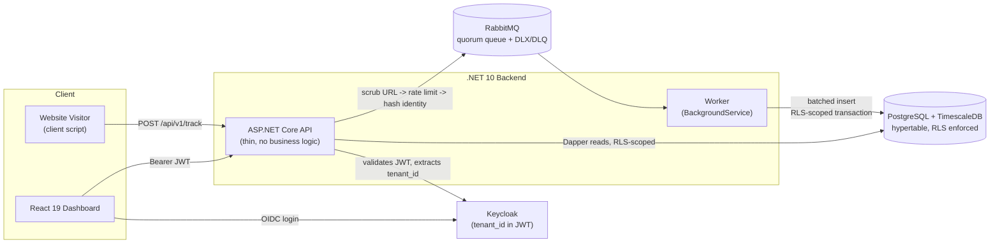

# Privacy-Engineered Analytics Platform

**A multi-tenant, PII-minimizing web analytics platform — built to prove that privacy engineering and real product functionality aren't in tension.**

`.NET 10` · `React 19` · `PostgreSQL + TimescaleDB` · `RabbitMQ` · `Keycloak` · `Dapper` · `EF Core 10`

---

## Why this exists

European companies deploying standard web analytics tools face real regulatory exposure under GDPR and national authorities like Sweden's IMY: raw IPs, user-agents, and cross-site cookies get collected by default, and "delete this user's data" is often close to impossible against a monolithic events table.

This project is a from-scratch analytics SaaS that takes the opposite approach: **PII minimization and tenant isolation are enforced structurally — by the database and the ingestion pipeline — not by application-level discipline that someone can forget.** It was built as a portfolio-grade demonstration of backend engineering practice (CQRS, fail-closed multi-tenancy, message-driven ingestion, defense-in-depth secrets handling), not as a production-ready commercial product.

It does **not** claim to collect "zero PII." Hashed IP/UA pairs are pseudonymous data under GDPR Recital 26, not anonymous data — that distinction is treated as a first-class design constraint throughout, not a footnote. See [Privacy Model](#privacy-model-the-two-tier-identity-system) below.

---

## Table of Contents

- [Architecture](#architecture)
- [Privacy Model: The Two-Tier Identity System](#privacy-model-the-two-tier-identity-system)
- [Tenant Isolation: Row-Level Security, Fail-Closed](#tenant-isolation-row-level-security-fail-closed)
- [Tech Stack](#tech-stack)
- [Repository Structure](#repository-structure)
- [Getting Started](#getting-started)
- [API Reference](#api-reference)
- [Testing](#testing)
- [Verified Load Test Results](#verified-load-test-results)
- [Security Notes](#security-notes)
- [Known Limitations & Roadmap](#known-limitations--roadmap)

---

## Architecture



**Write path:** `Api` never touches the database directly for ingestion — it scrubs the URL, computes identity hashes, and publishes to RabbitMQ, returning `202 Accepted` immediately. `Worker` is the only thing that writes `analytics_events`, in batches, inside a transaction that sets the Postgres tenant session variable before inserting.

**Read path:** the dashboard authenticates through Keycloak, and every query the API makes against Postgres goes through a single Dapper helper that sets `app.current_tenant_id` from the validated JWT before running — the same mechanism whether the query came from a handler written by hand or (eventually) generated by the AI module. See [Known Limitations](#known-limitations--roadmap) for the current state of that module.

---

## Privacy Model: The Two-Tier Identity System

| | **Tier 1 — Anonymous traffic** | **Tier 2 — Authenticated, opted-in traffic** |
|---|---|---|
| Identifier | `AnonymousDailyHash` | `DurableHash` |
| Derivation | `SHA-256(IP + UserAgent + DailySalt)` | Tenant-scoped `HMAC-SHA256` |
| Salt/key rotation | Salt rotates **daily** | Key is static, stored out-of-band |
| Cross-day linkability | None, by construction | Stable across sessions |
| Unique-visitor count | HyperLogLog estimate, labeled **"Estimated"** | Exact `COUNT(DISTINCT)` |
| Erasure | None needed — unlinkable after 24h | Hard delete on request |

Two properties matter here more than the mechanism itself:

1. **The daily salt rotation is the actual privacy guarantee**, not an implementation detail. Because the salt changes every day, the same real visitor produces an unlinkable hash from one day to the next. The direct cost is that 7-day anonymous unique-visitor counts trend toward *overcounting* as the window widens — the same person can contribute a "new" pseudonym on each visiting day. This is documented and surfaced in the UI (`"Estimated"` label), not hidden.
2. **The Tier 2 HMAC signing key is read from a Docker secret file at runtime — never from `appsettings.json`, an environment variable holding the literal key, or a database column.** A signing key sitting next to the data it protects means a single database compromise re-identifies every authenticated user retroactively; keeping it out-of-band is a one-line architectural decision that materially changes the blast radius of a breach.

Raw IP addresses and User-Agent strings are never persisted — not to Postgres, not to the RabbitMQ queue. Only the derived hashes cross that boundary.

---

## Tenant Isolation: Row-Level Security, Fail-Closed

Every tenant-scoped table (`analytics_events`, `erasure_audit_log`) has:

```sql
ALTER TABLE analytics_events ENABLE ROW LEVEL SECURITY;
ALTER TABLE analytics_events FORCE ROW LEVEL SECURITY;   -- also binds the table owner/app role

CREATE POLICY tenant_isolation_select ON analytics_events
    USING (organization_id = current_setting('app.current_tenant_id', true)::uuid);
```

`FORCE` matters: plain `ENABLE ROW LEVEL SECURITY` silently exempts the table-owner role, which is usually the exact role the application connects as — a policy that looks correct but is a no-op in practice. This is the single easiest way for a multi-tenant system to *look* secure while it isn't, and it's the first thing the test suite checks.

Enforcement, structurally:

- Every Dapper read runs through one shared helper that issues `SET LOCAL app.current_tenant_id = @tenantId` (sourced from the JWT-derived `ICurrentTenant`, never parsed ad hoc by a handler) before the real query, in the same transaction.
- If the session variable is missing or invalid, the policy returns **zero rows** — never an exception that a `catch` block could accidentally swallow.
- The Worker sets the same session variable per-tenant batch before its bulk insert, so the write path is covered by the identical policy, not a separate trust boundary.
- Integration tests (`Rls/RlsTenantIsolationTests.cs`, `Rls/DashboardQueriesIsolationTests.cs`) assert the zero-rows-when-missing behavior directly against a real Postgres instance, and are written to fail if `FORCE` is ever removed — this was verified by temporarily removing the clause and confirming the test suite catches it.

---

## Tech Stack

| Layer | Choice | Why |
|---|---|---|
| Backend | .NET 10 (`net10.0`), ASP.NET Core Minimal APIs | Modern C#, native `RateLimiting` middleware, minimal ceremony for a thin API layer |
| CQRS dispatch | MediatR | Clean command/query separation without hand-rolled dispatch |
| Reads | Dapper | Raw execution speed for reporting queries, explicit SQL, explicit RLS session wiring |
| Writes | EF Core 10 | Domain validation and migrations for the write model |
| Message broker | RabbitMQ (quorum queues, DLX/DLQ) | Decouples ingestion latency from database write latency; poison messages dead-letter after 5 delivery attempts instead of looping forever |
| Database | PostgreSQL + TimescaleDB (`analytics_events` as a hypertable partitioned on `timestamp`) | Comfortably handles the ~167 events/sec target without the operational overhead of a dedicated columnar store (e.g. ClickHouse) — a scoped trade-off, not an oversight |
| Cardinality estimation | Citus `hll` extension | HyperLogLog sketches for Tier 1 unique-visitor estimates |
| Auth | Keycloak (local Docker, realm auto-imported) | Real OIDC/JWT flow with a custom `tenant_id` claim mapper, not a mocked auth layer |
| Frontend | React 19 + TypeScript + Vite | Fast dev loop, modern React |
| Styling / UI primitives | Tailwind CSS 4, Radix UI | Accessible primitives, utility-first styling |
| Charts | Recharts | Time-series and metric visualization |

---

## Repository Structure

```
backend/
  src/
    PrivacyAnalytics.Api             ASP.NET Core Web API — thin, no business logic
    PrivacyAnalytics.Worker          BackgroundService — RabbitMQ consumer, batched inserts
    PrivacyAnalytics.Domain          Class library, zero external dependencies
    PrivacyAnalytics.Infrastructure  EF Core, Dapper, RabbitMQ client — all data access
    PrivacyAnalytics.Contracts       Shared DTOs referenced by Api and Worker
  tests/
    PrivacyAnalytics.UnitTests
    PrivacyAnalytics.IntegrationTests
    PrivacyAnalytics.SmokeTest
  PrivacyAnalytics.slnx
docker/
  Dockerfile.api
  Dockerfile.postgres-timescale      Custom TimescaleDB image, includes the `hll` extension
  Dockerfile.rabbitmq
  init-db/                           Extension bootstrap SQL
  keycloak/analytics-realm-export.json   Committed realm — auto-imports on first boot
  secrets/                           HMAC key + daily-salt seed generation (gitignored output)
frontend/                            React 19 + TypeScript + Vite + Tailwind, independent app
k6/                                  Load test script + usage notes
docs/
  spec.md                            Hardened technical specification (source of truth)
  load-test-demo-summary.md          Verified k6 results
docker-compose.yml
AGENTS.md                            Hard architectural rules for AI coding agents working in this repo
```

Reference direction is fixed: `Api` and `Worker` depend on `Infrastructure` and `Domain`; `Infrastructure` depends on `Domain`. **Nothing depends on `Api` or `Worker`.** This is what makes the CQRS split enforceable rather than aspirational — business logic living in `Api` "to keep it simple" is treated as an architectural violation, not a style nit (see `AGENTS.md`).

---

## Getting Started

### Prerequisites

- .NET 10 SDK
- Node.js 20+ and `pnpm` (a lockfile is committed; `npm` will also work but isn't the tested path)
- Docker Desktop (Compose V2)
- `openssl` (for secret generation — preinstalled on macOS/Linux; use WSL or Git Bash on Windows)
- [k6](https://k6.io/docs/getting-started/installation/) — optional, only needed to run the load test yourself

### 1. Generate local secrets

The HMAC signing key and daily-salt seed are **not** committed (by design — see [Privacy Model](#privacy-model-the-two-tier-identity-system)):

```bash
./docker/secrets/generate-secrets.sh
```

### 2. Create a root `.env` file

`docker-compose.yml` expects these variables and none are committed as an example file — create `.env` at the repo root:

```env
POSTGRES_USER=analytics
POSTGRES_PASSWORD=change-me
POSTGRES_DB=analytics
RABBITMQ_DEFAULT_USER=analytics
RABBITMQ_DEFAULT_PASS=change-me
KEYCLOAK_ADMIN=admin
KEYCLOAK_ADMIN_PASSWORD=change-me
```

### 3. Start the containerized stack

```bash
docker compose up --build
```

This brings up `postgres-timescale`, `rabbitmq`, `keycloak`, and `api` — each gated by a real healthcheck (`pg_isready`, the RabbitMQ management API, Keycloak's `/health/ready`), with `depends_on: condition: service_healthy` so nothing starts against a dependency that isn't actually ready. The Keycloak realm (`analytics-platform`, with the `analytics-api` and `analytics-web` clients and a `tenant_id` claim mapper) auto-imports from `docker/keycloak/analytics-realm-export.json` — no manual admin-console step.

Two demo users are pre-seeded in the committed realm export, one per tenant:

| Username | Password | Tenant ID |
|---|---|---|
| `testuser1` | `password123` | `00000000-0000-0000-0000-000000000001` |
| `testuser2` | `password123` | `00000000-0000-0000-0000-000000000002` |

> If a fresh import ever leaves these unusable, `reset_passwords.sh` and `setup-keycloak.sh` at the repo root are `kcadm.sh`-based fallbacks (run inside the `analytics-keycloak` container).

### 4. Apply database migrations

```bash
cd backend
dotnet ef database update -p src/PrivacyAnalytics.Infrastructure -s src/PrivacyAnalytics.Api
```

This creates `organizations`, `analytics_events` (converted to a TimescaleDB hypertable partitioned on `timestamp`, with `FORCE ROW LEVEL SECURITY` policies applied), and `erasure_audit_log` (insert-only grant).

### 5. Seed a tenant

There's no seed script yet (see [Known Limitations](#known-limitations--roadmap)) — insert an `Organization` row whose `Id` matches a Keycloak `tenant_id` above, so dashboard reads have somewhere to point:

```sql
INSERT INTO organizations (id, name, public_write_key)
VALUES ('00000000-0000-0000-0000-000000000001', 'Demo Tenant 1', gen_random_uuid());
```

Note the generated `public_write_key` — that's the value the client-side tracking script sends as `X-Tenant-Id` when calling `/api/v1/track`.

### 6. Run the Worker

The Worker isn't containerized yet — run it alongside the Compose stack:

```bash
dotnet run --project backend/src/PrivacyAnalytics.Worker
```

### 7. Run the frontend

Also not containerized — runs against the API on `localhost:5115` and Keycloak on `localhost:8080`:

```bash
cd frontend
pnpm install
pnpm dev
```

Visit `http://localhost:5173`, log in as `testuser1` / `password123`, and you should land on a dashboard scoped to tenant 1.

### 8. Send a test event

```bash
curl -X POST http://localhost:5115/api/v1/track \
  -H "Content-Type: application/json" \
  -H "X-Tenant-Id: <public_write_key from step 5>" \
  -d '{"url":"https://example.com/pricing?ref=twitter","eventType":"pageview"}'
```

Expect a `202 Accepted` with the query string already stripped before anything logs or hashes it. The event should appear in `analytics_events` within a few seconds via the Worker, and in the dashboard's pageview chart on next refresh.

---

## API Reference

| Method | Route | Auth | Description |
|---|---|---|---|
| `POST` | `/api/v1/track` | None (public write key via `X-Tenant-Id` header) | Accepts `{ url, eventType }`, strips query params, rate-limited 100 req/sec per tenant, publishes to RabbitMQ, returns `202 Accepted` |
| `GET` | `/api/v1/analytics/visitors` | Bearer JWT | Tier 2 exact uniques + Tier 1 HLL-estimated uniques, returned as separate fields |
| `GET` | `/api/v1/analytics/pageviews` | Bearer JWT | Daily pageview counts over a date range |
| `POST` | `/api/v1/analytics/erasure` | Bearer JWT | Hard-deletes all events matching a `DurableHash` for the caller's tenant; writes one `ErasureAuditLog` row in the same transaction |

All authenticated routes resolve `tenant_id` from the validated JWT into a scoped `ICurrentTenant` — no handler parses a token itself.

---

## Testing

```bash
cd backend
dotnet test                              # unit + integration tests
```

- **Unit tests** — identity hashing (Tier 1 salt rotation, Tier 2 HMAC), Docker secret reading, erasure audit log protection (insert-only grant), purge command handling.
- **Integration tests** (require a running Postgres instance) — RLS tenant isolation with the missing-variable-returns-zero-rows case, dashboard query isolation, erasure endpoint behavior, track endpoint validation, end-to-end ingestion (`track` → RabbitMQ → Worker → row in Postgres), and Worker idempotency (duplicate messages don't double-insert, via `ON CONFLICT (event_id, timestamp) DO NOTHING`).
- **Smoke test** — a standalone console project that exercises the stack against a live Compose environment.

Run the load test separately (see below); it's not part of `dotnet test`.

---

## Verified Load Test Results

From `docs/load-test-demo-summary.md`, run against the full local stack (`k6/track-load-test.js`, 200 req/sec sustained for 60s, 12,000 requests):

| Metric | Target (NFR-1) | Measured |
|---|---|---|
| p95 ingestion latency | < 50 ms | **3.24 ms** (~15x headroom) |
| Success rate | > 99% | **100.00%** |
| Sustained throughput | 200 req/sec | **200.01 req/sec** |
| Max latency | < 50 ms | 27.86 ms |

To reproduce:

```bash
# seed 5 test organizations first — see k6/README.md for the exact SQL
k6 run k6/track-load-test.js
```

---

## Security Notes

- **Secrets never touch application config.** The HMAC signing key and daily-salt seed are Docker secret files mounted at `/run/secrets`, read once at startup — grep the repo, `appsettings.json`, and the database and you won't find them. A dev-only fallback (`Identity:AllowUnmanagedDevSecrets`) exists for running the API outside Docker without mounting anything; it's explicitly disabled in the production configuration, so a missing secret fails startup fast instead of silently degrading re-identification resistance.
- **RLS is fail-closed by construction**, not by convention — see [Tenant Isolation](#tenant-isolation-row-level-security-fail-closed).
- **The erasure audit trail is structurally tamper-resistant**: the application's database role has no `UPDATE`/`DELETE` grant on `erasure_audit_log`, and the purge + audit-log insert happen in a single transaction, so a purge that isn't logged should be impossible.
- **Rate limiting is per-tenant, not global**: a `TokenBucketRateLimiter` partitioned on the `X-Tenant-Id` header caps each tenant at 100 req/sec, so the platform-wide ~167 events/sec target is reached by aggregating across tenants rather than one tenant being able to starve another. Requests with a missing/invalid tenant header collapse into a single shared "unknown" bucket rather than bypassing the limiter.

---

## Known Limitations & Roadmap

Written honestly, not glossed over — this is the difference between a gap discovered live and a documented, deliberate scope decision:

- **The Worker and frontend aren't containerized yet.** `docker compose up` brings up Postgres, RabbitMQ, Keycloak, and the API, but the Worker and the React dev server currently need to be run manually alongside it. True one-click cold start is a near-term goal, not the current state.
- **No tenant seed script.** Standing up a demo tenant currently means hand-inserting an `Organization` row (see [Getting Started](#getting-started), step 5). A migration seed or CLI command is a natural next addition.
- **Top-pages reporting query exists but isn't exposed yet.** `GetTopPagesQuery`/`GetTopPagesQueryHandler` are implemented in `Infrastructure`, following the same RLS-wired Dapper pattern as the other reads, but aren't mapped to an API route in `Program.cs` yet.
- **Path-segment PII scrubbing is out of scope for v1.** Query-string parameters are stripped (the most common leak vector), but PII embedded directly in a path segment (e.g. `/password-reset/user@email.com`) is not. A configurable, regex-based path scrubber is a planned post-MVP addition.

The full technical specification, including the complete risk register and the reasoning behind each of these trade-offs, lives in [`docs/spec.md`](docs/spec.md).
